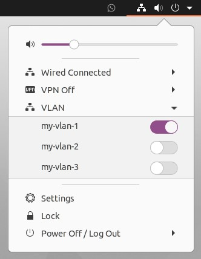

# GNOME VLAN Switcher

### A GNOME extension to activate and deactivate VLAN connections from the system panel.

<p align="center">
    
</p>

## Installation

### From extensions.gnome.org
...

### From source code

```
rm -r ~/.local/share/gnome-shell/extensions/vlan-switcher@darcato.github.io
git clone https://github.com/darcato/gnome-vlan-switcher ~/.local/share/gnome-shell/extensions/vlan-switcher@darcato.github.io
```

## Usage

This will let you activate or deactivate existing VLAN connections, managed by the network manager. You first need to create the VLANs with your preferred tool, such as `nm-connection-editor`. The status of each connections is refreshed only when you open the popup menu.

## License
[GPLv3](http://www.gnu.org/licenses/gpl-3.0.en.html)